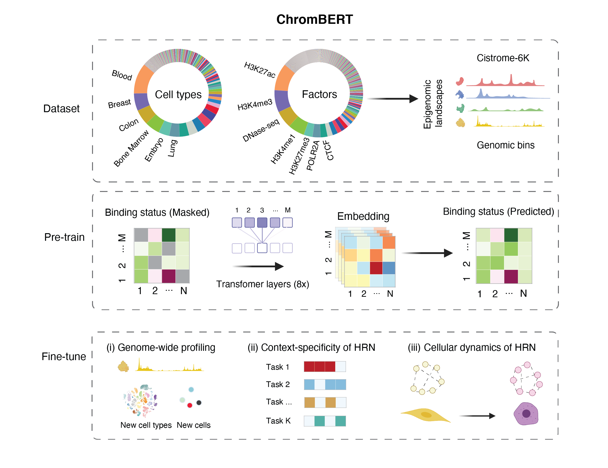

# ChromBERT: A pre-trained foundation model for context-specific transcription regulatory network 
[](https://chrombert.readthedocs.io/en/)
[](https://www.gnu.org/licenses/gpl-3.0)
[](https://chrombert.readthedocs.io/en/)

**ChromBERT** is a pre-trained deep learning model designed to capture the genome-wide co-association patterns of approximately one thousand transcription regulators, thereby enabling accurate representations of context-specific transcriptional regulatory networks (TRNs). As a foundational model, ChromBERT can be fine-tuned to adapt to various biological contexts through transfer learning. This significantly enhances our understanding of transcription regulation and offers a powerful tool for a broad range of research and clinical applications in different biological settings.



## Installation
For direct usage, it is recommended to utilize the [Singularity image](#installation-using-singularity). For development purposes, installing from [source](#installation-from-source) is advised.

### Installation from source

ChromBERT is compatible with Python versions 3.8 or higher and requires PyTorch 2.0 or above, along with FlashAttention-2. These dependencies must be installed prior to ChromBERT.


#### Installing PyTorch 
Follow the detailed instructions on [PyTorch’s official site](https://pytorch.org/get-started/locally/) to install PyTorch according to your device and CUDA version specifications.

**Note: ChromBERT has been tested with Python 3.9+ and Torch 2.0 to 2.4 (inclusive). Compatibility with other environments is not guaranteed.**  

#### Installing FlashAttention-2
Execute the following commands to install the requried packages and [FlashAttention-2](https://github.com/Dao-AILab/flash-attention).
```shell
# install the required packages for FlashAttention-2
pip install packaging
pip install ninja

pip install flash-attn==2.4.* --no-build-isolation # FlashAttention-3 is not supported yet, please install FlashAttention-2
```

#### Installing ChromBERT
Clone the repository and install ChromBERT using the commands below:
```shell
git clone https://github.com/TongjiZhanglab/ChromBERT.git
cd ChromBERT
pip install .
```

Installation typically takes less than five minutes.


Then download required pre-trained model and annotation data files from Hugging Face to ~/.cache/chrombert/data.
```shell
chrombert_prepare_env
```

Alternatively, if you're experiencing significant connectivity issues with Hugging Face, you can try to use the `--hf-endpoint` option to connect to an available mirror of Hugging Face for you.
```shell
chrombert_prepare_env --hf-endpoint <Hugging Face endpoint>
```

#### Verifying Installation

To verify installation, execute the following command:
```python
import chrombert
```

### Installation Using Singularity

We provide a pre-built Singularity image available [here](https://drive.google.com/file/d/1ePmDK6DANSq-zkRgVBTxSBnKBZk-cEzM/view?usp=sharing).

After installing `Singularity` (or `Apptainer`) and downloading the image (`chrombert.sif`), you can use the built-in `python` environment with:

```bash
singularity exec --nv chrombert.sif python -c "import chrombert; print('hello chrombert!')"
```

You can execute other built-in commands through the image as well. For example, to download the required pre-trained models and annotation files from Hugging Face to `~/.cache/chrombert/data`, run:

> **Note:** You must execute this command to prepare the environment, as the image does not include checkpoints and additional data by default to minimize size.

```bash
singularity exec --nv chrombert.sif chrombert_prepare_env
```

To run your own Python scripts, use:

```bash
singularity exec --nv chrombert.sif python <your_script.py>
```

The image also includes a built-in Jupyter kernel for interactive script development via `jupyter notebook` or editors like `VSCode`:

```bash
singularity exec --nv chrombert.sif jupyter notebook [other parameters]
```

By default, Singularity mounts your home directory inside the container. If you need to mount additional directories, use the `--bind` parameter. Refer to the [Singularity documentation](https://docs.sylabs.io/guides/3.0/user-guide/bind_paths_and_mounts.html) for more details.


## Usage

For detailed information on usage, please checkout the documentations and tutorials at [chrombert.readthedocs.io](https://chrombert.readthedocs.io/en/latest/).


## Pre-trained Model Zoo

ChromBERT has been initially trained on the human Cistrome-Human-6K dataset at 1-kb resolution. Currently available pre-trained models include:
| Model Name                | Description                                              | Download Link                                                                                     |
| :------------------------ | :------------------------------------------------------- | :------------------------------------------------------------------------------------------------ |
| Human-6K-1kb | Pre-trained on Cistrome-Human-6K dataset at 1-kb resolution | [Download](https://huggingface.co/datasets/TongjiZhanglab/chrombert) |
| Mouse-5K-1kb | Pre-trained on Cistrome-Mouse-5K dataset at 1-kb resolution | [Download](https://huggingface.co/datasets/TongjiZhanglab/chrombert) |

Note: Models can also be downloaded via the `chrombert_prepare_env` command, as outlined in the installation section.

## Fine-tuning ChromBERT for downstream tasks

Explore detailed examples of how to fine-tune ChromBERT for downstream tasks such as prompt-enhanced fine-tuning for generative prediction, and analyses focused on locus specificities and cellular dynamics of TRNs, by visiting our examples page at [chrombert.readthedocs.io](https://chrombert.readthedocs.io/en/latest/).

## Citing ChromBERT

```bibtex
@article {Yu2025.03.29.646077,
	author = {Yu, Zhaowei and Yang, Dongxu and Chen, Qianqian and Zhang, Yuxuan and Li, Zhanhao and Wang, Yucheng and Wang, Chenfei and Zhang, Yong},
	title = {Learning interpretable representation for context-specific transcription regulatory networks using a foundation model},
	year = {2025},
	doi = {10.1101/2025.03.29.646077},
	publisher = {Cold Spring Harbor Laboratory},
	journal = {bioRxiv}
}
```